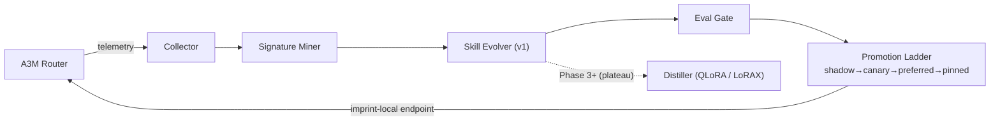

# Imprint — Self-Learning Task Handler for A3M Router
### *Every request leaves an imprint. Eventually, the imprints become instinct.*

**Package:** `imprint-router` · **Product name:** Imprint · **Repo:** [Das-rebel/imprint](https://github.com/Das-rebel/imprint) ✅ live
**Status:** Plan v3 — council-reviewed, Phase 0 in progress

---

## Changelog

| Ver | Date | Change |
|-----|------|--------|
| v1 | 2026-08-26 | Original draft — weight-distillation-first |
| v2 | 2026-08-26 | Agent-council rebuild: context-evolution-first pivot; naming resolved |
| v3 | 2026-08-26 | Repo live; added technical specs, data schemas, integration contract, eval methodology, competitive matrix, KPIs, risk register, GTM |

---

## Executive Summary

Imprint is a complementary service that watches A3M Router traffic, detects repeatable task
patterns ("signatures"), and progressively optimizes them — **v1 by evolving context/skill-prompts,
v2 by distilling weights into self-managed local adapters.** Its key differentiator is an adaptive
learning policy driven by router economics data (cost-per-signature, cache affinity) that no
competitor has. Promotion ladder (`shadow → canary → preferred → pinned`) with drift-triggered
auto-demote ensures quality never silently regresses. The result: your AI bill decays over time.

---

## 1. Strategic Pivot (from council review)

**v1 evolves CONTEXT, not weights.**

| | Weight-distillation (old plan) | Context-evolution (new v1) |
|---|---|---|
| Mechanism | QLoRA per signature | Optimized skill-prompts + few-shot packs per signature |
| Ship time | ~10 weeks to first value | **~3 weeks** |
| Risk | Silent quality regression, GPU needed | Prompt-only failure modes, CPU-only |
| Evidence | ACE framework: context often beats weights for narrow adaptation | SkillOpt (16K⭐) validates demand |
| v2 role | — | Weights kick in when prompts plateau (Phase 3+) |

Rationale formalized in [ADR-001](docs/adr/ADR-001-context-evolution-before-weights.md).
Microsoft SkillOpt proves trace→skill works; nobody pairs it with router economics. That's our wedge.

---

## 2. Architecture



- **Serving backend (v2): LoRAX** (Apache-2, 3.8K⭐) — purpose-built multi-adapter serving on one 24GB GPU.
- **Escalation-on-uncertainty:** low-confidence responses return `X-Imprint-Escalate: true`; A3M routes live.
- **Loose coupling:** Imprint subscribes to logs; appears back as provider `imprint-local` (cost≈0).

---

## 3. Component Specifications

### 3.1 Collector (`imprint/collector.py`)
Consumes **generic OpenAI-compatible request logs** (not A3M-specific formats — keeps Imprint
reusable with LiteLLM/OpenRouter exports). PII redaction at ingest: emails → `[EMAIL]`,
cards → `[CARD]`, API keys → `[KEY]`.

**Storage:** SQLite (Phase 0–1) → Parquet (Phase 2+). Zero infra, notebook-friendly.

```sql
CREATE TABLE pairs (
  id TEXT PRIMARY KEY,            -- sha256(prompt)[:16]
  ts INTEGER,                     -- unix ms
  signature_id TEXT,              -- assigned by miner; NULL until clustered
  prompt TEXT,                    -- redacted
  response TEXT,                  -- redacted
  model TEXT, provider TEXT,
  cost_usd REAL, latency_ms INTEGER,
  cache_hit BOOLEAN,
  accepted BOOLEAN DEFAULT NULL   -- user feedback / heuristic acceptance
);
CREATE INDEX idx_pairs_sig ON pairs(signature_id, ts);
```

### 3.2 Signature Miner (`imprint/miner.py`)
1. Embed redacted prompts (local `BAAI/bge-small-en`; no data leaves the machine)
2. Cosine-threshold grouping (≥0.86 similarity) → HDBSCAN refinement (Phase 1)
3. **Economics ranking** (the differentiator):
   `priority = volume_7d × avg_cost × cache_miss_ratio`
4. Lifecycle state machine per signature: `candidate → active → plateaued → retired`
5. Persistence: JSON registry `{signature_id, centroid, sample_ids[], volume_7d, economics}`

### 3.3 Skill Evolver (v1) (`imprint/evolver.py`)
- Per-signature prompt template + few-shot pack (sampled from accepted pairs)
- Every evolved artifact hash-versioned (`sha256(template + shots)[:12]`) for clean ladder A/Bs
- Evolution loop (Phase 1): propose variant → shadow-eval on held-out samples → keep if better
- **Plateau detector:** 3 consecutive evolutions with <5% improvement → flag for distiller queue
- Phase 1 may adopt DSPy under the hood; interface stays ours

### 3.4 Eval Gate
Three signals, cheapest first:
1. **Programmatic checks** — schema validity, length bounds, exact-match where possible (free)
2. **Agreement stats** — skill output vs baseline output on same input (embedding cosine ≥ τ)
3. **LLM-judge** — pairwise preference, cheap model, only on disagreement cases

**North-star metric: regression rate** (fraction of outputs worse than baseline), not savings.

### 3.5 Promotion Ladder (`imprint/ladder.py`) — enforced in code

| Transition | Min samples | Max regression rate | Min cost savings |
|------------|-------------|---------------------|------------------|
| SHADOW → CANARY | 50 | 2% | 10% |
| CANARY → PREFERRED | 200 | 1% | 25% |
| PREFERRED → PINNED | 500 | 0.5% | 30% |

Drift demote steps back exactly one stage. All criteria unit-tested (`tests/test_ladder.py`).

### 3.6 Drift Monitor (`drift/`, Phase 2)
- **Input drift:** rolling mean embedding distance vs signature centroid > 2σ → demote + re-mine
- **Outcome drift:** weekly re-shadow of 5% of preferred traffic; regression spike → demote
- **Cost drift:** if provider prices change such that savings < floor → demote to CANARY

---

## 4. Integration Contract (MODEL-AGNOSTIC)

Imprint is **not OpenAI-only**. It auto-detects and speaks every major LLM API shape,
both on ingest (collector) and egress (serving endpoint):

| Format | Ingress detection | Egress response |
|--------|-------------------|-----------------|
| OpenAI ChatCompletion | `messages: [{role, content}]` | standard `chat.completion` object |
| Anthropic Messages | top-level `system` + assistant in `messages` | `{type:"message", content:[{type:"text"}]}` |
| Gemini-style | `contents: [{role, parts:[{text}]}]` | `{candidates:[{content:{parts}}]}` |
| Raw completion | flat `prompt` field | `{response}` |

Content parts (vision-style arrays) are flattened to text; multimodal passthrough is Phase 4.
PII redaction runs inside the format adapter — one redaction path for all formats.

**Inbound (Imprint reads):** any of the above as JSONL, plus economics fields
(`cost_usd`/`usage.total_cost`, `latency_ms`, `cache_hit`) when present.

**Outbound:** Imprint serves as provider `imprint-local` responding in the caller's native
format, with imprint metadata both as HTTP headers AND in-body:
- `X-Imprint-Signature: <id>` / `imprint.signature` — which signature handled it
- `X-Imprint-Version: <hash>` / `imprint.version` — exact skill version served
- `X-Imprint-Escalate: true` / `imprint.escalate` — low confidence; caller should retry via normal routing

**Config surface (one entry in any router):**
```json
{"providers": {"imprint-local": {"endpoint": "http://localhost:8477/v1", "cost_per_1k": 0.0}}}
```

---

## 5. Guardrails

- **Training refusal threshold:** <100 occurrences/week/signature → refuse to learn
- **Optimization time cap per signature:** ≤ `monthly_savings / $10` hours of compute
- **Behavioral cloning objectives only** — train/evolve exclusively on accepted outputs
- **No-regression rule:** any promotion must win on BOTH cost and quality; ties favor baseline
- **Replay buffers + model merging** (v2) against catastrophic forgetting
- **Local-first:** prompts never leave the machine unless user opts into cloud eval models

---

## 6. Competitive Landscape (verified 2026-08-26)

| Project | What it does | Gap Imprint fills |
|---------|--------------|-------------------|
| Microsoft SkillOpt (16K⭐) | Trains reusable NL skills from traces | No cost/economics awareness; not router-integrated |
| DSPy | Programmatic prompt optimization | No signature discovery; no promotion safety ladder |
| OpenPipe / Predibase | Managed fine-tuning platforms | Cloud-only; no continuous local learning; no routing integration |
| LoRAX (3.8K⭐) | Multi-LoRA serving infra | Serving layer only — no learning loop |
| Gorilla/Harmony | Tool-use model training | Domain-specific (API calls), not general task patterns |
| Mem0 / Letta | Memory systems | Store/retrieve context, don't optimize task execution |

**The open gap (validated by research agents ×10): nobody closes the loop from router
economics → learning priority → safe rollout → measured bill decay.**

---

## 7. Phased Roadmap

| Phase | Duration | Deliverable | Exit criteria | Status |
|-------|----------|-------------|---------------|--------|
| **0: Validate** | 1 wk | 24–48h capture → top signature → manual prompt opt → Δcost | ≥30% cut on one real signature | 🚧 issues #1–#3 |
| **1: Skill Evolver** | 3 wks | Automated evolution + eval gate | 5 signatures auto-optimized, zero regressions | |
| **2: Promotion ladder** | 4 wks | FSM live + drift demote | 3+ signatures preferred, 30 days no-touch | ✅ FSM code + tests done |
| **3: Distiller (v2)** | 6 wks | QLoRA via LoRAX for plateaued signatures | distilled adapter beats best prompt-skill | |
| **4: Productize** | — | `pip install imprint-router`, dashboard, benchmark post | Public launch | |

---

## 8. KPIs (what success looks like)

| Metric | Definition | Target @ Phase 2 |
|--------|-----------|-------------------|
| Bill decay rate | Month-over-month routed-cost reduction attributable to Imprint | ≥15%/mo on active workloads |
| Signature coverage | % of volume handled by PINNED skills | ≥40% |
| Regression rate | Worse-than-baseline outputs across promoted skills | <0.5% |
| Escalation precision | When Imprint escalates, was it right to? | >90% |
| Time-to-value | Install → first promoted skill | <7 days |

---

## 9. Risk Register

| # | Risk | Likelihood | Impact | Mitigation | Owner |
|---|------|-----------|--------|------------|-------|
| R1 | Real traffic too sparse (<100/wk/signature) | Med | Fatal | Phase 0 gate kills early; fallback positioning = batch analytics tool | Subho |
| R2 | Prompt plateau detection unreliable | Med | High | Human-in-loop approval for PINNED until precision proven | Phase 1 |
| R3 | Shadow-mode 2x latency annoys users | Low | Med | Shadow only sampled traffic (10%); make configurable | Phase 2 |
| R4 | Provider price changes invalidate savings | High | Low | Cost drift monitor auto-demotes; savings recomputed nightly | Phase 2 |
| R5 | A3M coupling creep | Med | Med | Integration contract (§4) is the only allowed touchpoint; CI check | Ongoing |
| R6 | PLAN becomes graveyard | — | — | Exit criteria live in code + GitHub issues (#1–#3), 2-week clock | Subho |

---

## 10. Go-To-Market Sketch

- **Launch post:** "Your AI bill should decay over time" — with real bill-decay curve from Phase 0/1 data
- **Benchmark claim to publish (falsifiable):** *"On N weeks of production router traffic, Imprint
  reduced recurring-task spend X% with regression rate below Y%."*
- **Distribution:** HN "Show HN", r/LocalLLaMA (warmed account first), Twitter thread riding
  A3M's existing biology-story audience
- **Ecosystem story:** A3M = the router (breadth) · Imprint = the learner (depth) · shared install base

---

## 11. Decisions Index

| ADR | Decision |
|-----|----------|
| [ADR-001](docs/adr/ADR-001-context-evolution-before-weights.md) | Context evolution before weight distillation |
| [ADR-002](docs/adr/ADR-002-package-name-imprint-router.md) | Package name `imprint-router` (npm conflicts documented) |
| [ADR-003](docs/adr/ADR-003-exit-criteria-in-code.md) | Promotion exit criteria enforced in code, not prose |

---

## Open Questions

1. Can prompt-plateau be detected reliably without human review? *(heuristic shipped; unvalidated)*
2. Do real A3M workloads produce signatures above the 100/week floor? *(Phase 0 answers)*
3. Will users accept shadow-mode latency overhead? *(mitigated by sampling, R3)*
4. Cross-deployment "signature marketplace" — federated pattern sharing without data leakage. Deferred to Phase 4.
