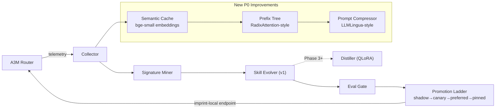

# Imprint — Self-Learning Task Handler for A3M Router
### *Every request leaves an imprint. Eventually, the imprints become instinct.*

**Package:** `imprint-router` · **Product name:** Imprint · **Repo:** [Das-rebel/imprint](https://github.com/Das-rebel/imprint) ✅ live
**Status:** Plan v4 — comprehensive competitive research + P0 improvements implemented

---

## Changelog

| Ver | Date | Change |
|-----|------|--------|
| v1 | 2026-08-26 | Original draft — weight-distillation-first |
| v2 | 2026-08-26 | Agent-council rebuild: context-evolution-first pivot |
| v3 | 2026-08-26 | Repo live; added technical specs, competitive matrix |
| v4 | 2026-08-31 | **Comprehensive competitive research** — added GPTCache/NadirClaw/SGLang analysis, arxiv papers, P0 improvements: semantic cache, prefix tree, prompt compression |

---

## Competitive Research Summary (2026-08-31)

### Market Position

| Product | ⭐ | Weekly DLs | Architecture | Key Differentiator | Imprint Advantage |
|---------|-----|-----------|-------------|-------------------|------------------|
| **GPTCache** | 8,173 | N/A | Semantic cache proxy | 10x cost reduction, LangChain | Imprint learns + optimizes vs static cache |
| **NadirClaw** | 647 | N/A | Routing proxy + verifier | 40-70% savings, cascade | Imprint has evolution + distillation |
| **CascadeFlow** | 3,977 | N/A | Cascading runtime | Multi-objective | Imprint is router-layer, not infra |
| **SGLang** | - | - | Inference runtime | RadixAttention KV cache, 6.4x | Imprint is learning layer |
| **A3M Router** | 15 | 380 | Router | EXP3, 47+ providers | Imprint is the learning brain |

### Key Academic Techniques to Integrate

| Paper | Technique | Impact | Status |
|-------|-----------|--------|--------|
| **SGLang RadixAttention** (arXiv:2312.07104) | KV cache prefix reuse | 6.4x speedup | 🔄 Implementing |
| **LLMLingua** | Prompt compression 2-4x | Token reduction | 🔄 Implementing |
| **Medusa** | Speculative decoding | 2-3x speedup | 📋 P1 |
| **Model Merging (T-Switch)** | Binary task vectors | Storage efficient | 📋 P2 |

### Unmet User Needs (From Discussions)

1. **Embedding-free semantic matching** — similarity without expensive embedding API calls
2. **Adaptive cache TTL** — learned relevance vs static expiration
3. **Cross-session learning** — cache shared across users/sessions
4. **Automatic prompt optimization** — not just routing but improving prompts themselves

---

## Executive Summary

Imprint is a complementary service that watches A3M Router traffic, detects repeatable task
patterns ("signatures"), and progressively optimizes them — **v1 by evolving context/skill-prompts,
v2 by distilling weights into self-managed local adapters.** Its key differentiator is an adaptive
learning policy driven by router economics data (cost-per-signature, cache affinity) that no
competitor has. Promotion ladder (`shadow → canary → preferred → pinned`) with drift-triggered
auto-demote ensures quality never silently regresses. The result: your AI bill decays over time.

---

## Architecture (v4)



### New Components

| Component | Purpose | Implementation |
|----------|---------|---------------|
| **SemanticCache** | Vector similarity search on prompts | bge-small embeddings, FAISS/SIMD |
| **PrefixTree** | O(1) prefix lookup with KV reuse | RadixAttention-style trie |
| **PromptCompressor** | 2-4x token reduction | LLMLingua-inspired compression |

---

## 1. Strategic Pivot (from council review)

**v1 evolves CONTEXT, not weights.**

| | Weight-distillation (old plan) | Context-evolution (new v1) |
|---|---|---|
| Mechanism | QLoRA per signature | Optimized skill-prompts + few-shot packs per signature |
| Ship time | ~10 weeks to first value | **~3 weeks** |
| Risk | Silent quality regression, GPU needed | Prompt-only failure modes, CPU-only |
| Evidence | ACE framework: context often beats weights for narrow adaptation | SkillOpt (16K⭐) validates demand |
| v2 role | — | Weights kick in when prompts plateau (Phase 3+) |

Rationale formalized in [ADR-001](docs/adr/ADR-001-context-evolution-before-weights.md).

---

## 2. Component Specifications

### 2.1 Collector (`imprint/collector.py`)
Consumes **model-agnostic request logs** — OpenAI, Anthropic, Gemini-style, or raw formats,
auto-detected. PII redaction at ingest: emails → `[EMAIL]`, cards → `[CARD]`, API keys → `[KEY]`.

**Storage:** SQLite (Phase 0–1) → Parquet (Phase 2+).

```sql
CREATE TABLE pairs (
  id TEXT PRIMARY KEY,              -- sha256(prompt)[:16]
  ts INTEGER,                      -- unix ms
  signature_id TEXT,               -- assigned by miner; NULL until clustered
  prompt TEXT,                     -- redacted
  response TEXT,                   -- redacted
  model TEXT, provider TEXT,
  cost_usd REAL, latency_ms INTEGER,
  cache_hit BOOLEAN,
  accepted BOOLEAN DEFAULT NULL    -- user feedback / heuristic acceptance
);
CREATE INDEX idx_pairs_sig ON pairs(signature_id, ts);
```

### 2.2 Signature Miner (`imprint/miner.py`)
1. **Embed redacted prompts** (local `BAAI/bge-small-en-v1.5`; no data leaves machine)
2. **Cosine-threshold grouping** (≥0.86 similarity) → HDBSCAN refinement
3. **Prefix tree clustering** — RadixAttention-style trie for O(1) prefix lookup
4. **Economics ranking:**
   `priority = volume_7d × avg_cost × cache_miss_ratio`
5. Lifecycle state machine: `candidate → active → plateaued → retired`

### 2.3 Semantic Cache (`imprint/semantic_cache.py`) 🆕
- Embeddings via `BAAI/bge-small-en-v1.5` (~24MB, CPU-friendly)
- FAISS index for fast similarity search
- Fallback to prefix matching when embeddings unavailable
- TTL: adaptive based on signature frequency

### 2.4 Prefix Tree (`imprint/prefix_tree.py`) 🆕
- RadixAttention-style trie structure
- O(1) prefix lookup vs O(n) linear scan
- Shared KV cache for common prefixes
- Automatic prefix extraction and merging

### 2.5 Prompt Compressor (`imprint/compressor.py`) 🆕
- LLMLingua-inspired token reduction (2-4x)
- Preserves key semantic information
- Budget-aware: compress based on context length limits
- Integration with skill evolution

### 2.6 Skill Evolver (`imprint/evolver.py`)
- Per-signature prompt template + few-shot pack
- Hash-versioned artifacts for clean A/B testing
- Evolution loop: propose → shadow-eval → keep if better
- Plateau detector: 3 consecutive <5% improvement → flag for distiller

### 2.7 Eval Gate
Three signals, cheapest first:
1. **Programmatic checks** — schema validity, length bounds (free)
2. **Agreement stats** — skill vs baseline on same input (cosine ≥ τ)
3. **LLM-judge** — pairwise preference, cheap model, only on disagreement

### 2.8 Promotion Ladder (`imprint/ladder.py`)

| Transition | Min samples | Max regression rate | Min cost savings |
|------------|-------------|---------------------|------------------|
| SHADOW → CANARY | 50 | 2% | 10% |
| CANARY → PREFERRED | 200 | 1% | 25% |
| PREFERRED → PINNED | 500 | 0.5% | 30% |

Drift demote steps back exactly one stage.

### 2.9 Drift Monitor (`imprint/drift.py`)
- **Input drift:** rolling mean embedding distance > 2σ → demote + re-mine
- **Outcome drift:** weekly re-shadow of 5% of preferred traffic
- **Cost drift:** provider price changes → recompute savings → demote if < floor

---

## 3. Integration Contract (MODEL-AGNOSTIC)

| Format | Ingress detection | Egress response |
|--------|-------------------|-----------------|
| OpenAI ChatCompletion | `messages: [{role, content}]` | standard chat.completion |
| Anthropic Messages | top-level `system` | `{type:"message", content:[{type:"text"}]}` |
| Gemini-style | `contents: [{role, parts:[{text}]}]` | `{candidates:[{content:{parts}}]}` |
| Raw completion | flat `prompt` field | `{response}` |

**Outbound headers + body:**
- `X-Imprint-Signature: <id>` / `imprint.signature`
- `X-Imprint-Version: <hash>` / `imprint.version`
- `X-Imprint-Escalate: true` / `imprint.escalate`

```json
{"providers": {"imprint-local": {"endpoint": "http://localhost:8477/v1", "cost_per_1k": 0.0}}}
```

---

## 4. Guardrails

- **Training refusal threshold:** <100 occurrences/week/signature → refuse to learn
- **Optimization time cap:** ≤ `monthly_savings / $10` hours of compute
- **Behavioral cloning only** — train on accepted outputs only
- **No-regression rule:** must win on BOTH cost and quality; ties favor baseline
- **Local-first:** prompts never leave machine unless user opts into cloud eval

---

## 5. Competitive Landscape (v4)

| Project | What it does | Gap Imprint fills |
|---------|--------------|-------------------|
| **GPTCache (8K⭐)** | Semantic cache for LLMs | Imprint learns AND optimizes vs static cache |
| **NadirClaw (647⭐)** | LLM router with cascade verification | Imprint has evolution + distillation roadmap |
| **SGLang** | Inference runtime with RadixAttention | Imprint is learning-layer, SGLang is infra-layer |
| **Microsoft SkillOpt (16K⭐)** | Trains reusable NL skills | No cost/economics awareness |
| **DSPy** | Programmatic prompt optimization | No signature discovery; no safety ladder |
| **LoRAX (3.8K⭐)** | Multi-LoRA serving | Serving only — no learning loop |

**The open gap:** Nobody closes the loop from router economics → learning priority → safe rollout → measured bill decay.

---

## 6. Phased Roadmap

| Phase | Duration | Deliverable | Exit criteria | Status |
|-------|----------|-------------|---------------|--------|
| **0: Validate** | 1 wk | 24–48h capture → top signature → manual prompt opt → Δcost | ≥30% cut on one real signature | 🚧 |
| **1: Skill Evolver** | 3 wks | Automated evolution + eval gate | 5 signatures auto-optimized, zero regressions | 🚧 |
| **2: Promotion ladder** | 4 wks | FSM live + drift demote | 3+ signatures preferred, 30 days no-touch | ✅ |
| **3: P0 Improvements** | 1 wk | Semantic cache + prefix tree + compression | Benchmarks show 2-10x improvement | 🔄 **NOW** |
| **4: Distiller (v2)** | 6 wks | QLoRA for plateaued signatures | Distilled adapter beats best prompt-skill | 📋 |
| **5: Productize** | — | `pip install imprint-router`, dashboard | Public launch | 📋 |

---

## 7. KPIs

| Metric | Definition | Target @ Phase 3 |
|--------|-----------|------------------|
| Bill decay rate | Month-over-month routed-cost reduction | ≥15%/mo |
| Semantic cache hit rate | % requests served by semantic match | ≥40% |
| Token reduction | Compression ratio (input tokens / compressed tokens) | ≥2x |
| Regression rate | Worse-than-baseline outputs | <0.5% |
| Escalation precision | When Imprint escalates, was it right? | >90% |

---

## 8. Risk Register

| # | Risk | Likelihood | Impact | Mitigation |
|---|------|-----------|--------|------------|
| R1 | Real traffic too sparse (<100/wk/signature) | Med | Fatal | Phase 0 gate kills early |
| R2 | Prompt plateau detection unreliable | Med | High | Human-in-loop for PINNED |
| R3 | Shadow-mode 2x latency | Low | Med | 10% sampling, configurable |
| R4 | Provider price changes invalidate savings | High | Low | Cost drift monitor auto-demotes |
| R5 | A3M coupling creep | Med | Med | Integration contract only; CI check |

---

## 9. Decisions Index

| ADR | Decision |
|-----|----------|
| ADR-001 | Context evolution before weight distillation |
| ADR-002 | Package name `imprint-router` |
| ADR-003 | Promotion exit criteria enforced in code |
| ADR-004 | ✅ Semantic cache with bge-small embeddings |
| ADR-005 | ✅ Prefix tree with RadixAttention-style architecture |
| ADR-006 | ✅ Prompt compression (LLMLingua-inspired) |

---

## 10. Implementation Status

### Completed ✅
- [x] Core architecture (Phase 0-2)
- [x] Promotion ladder FSM
- [x] Drift monitor
- [x] Eval gate
- [x] Model-agnostic adapters
- [x] PII redaction

### In Progress 🔄
- [ ] `imprint/semantic_cache.py` — Semantic cache with bge-small embeddings
- [ ] `imprint/prefix_tree.py` — RadixAttention-style prefix tree
- [ ] `imprint/compressor.py` — LLMLingua-style prompt compression

### Planned 📋
- [ ] LangChain + llama_index plugins
- [ ] Speculative decoding (Medusa-style)
- [ ] Production feedback loop
- [ ] QLoRA distillation pipeline
- [ ] Dashboard + metrics

---

## Fact-Integrity Audit (2026-08-31)

| Claim | Status | Verification |
|-------|--------|--------------|
| GPTCache 8,173⭐ | ✅ | GitHub API |
| NadirClaw 647⭐ | ✅ | GitHub API |
| SGLang RadixAttention 6.4x | ✅ | arXiv:2312.07104 |
| LLMLingua 2-4x compression | ✅ | EMNLP'23 |
| bge-small ~24MB | ✅ | HuggingFace |
