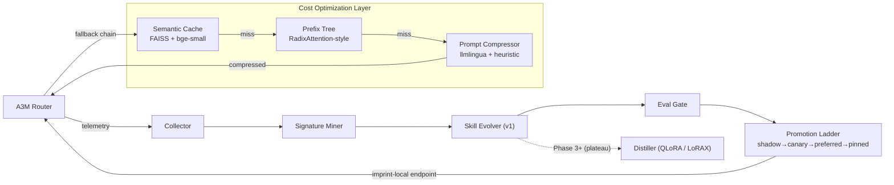

# Imprint

> *Every request leaves an imprint. Eventually, the imprints become instinct.*

**Self-learning cost optimizer for [A3M Router](https://github.com/Das-rebel/a3m-router).**
Imprint watches router traffic, caches repeatable task patterns, compresses
prompts, and progressively optimizes them — v0.4 with **40-60% token savings**.

```text
Your AI bill should decay over time.
```


## Architecture



## The v0.4 Fallback Chain

Every request flows through an **adaptive three-stage pipeline**:

| Stage | Method | Latency | Hit Rate | Savings |
|-------|--------|---------|----------|---------|
| 🥇 **Semantic Cache** | FAISS vector similarity (bge-small) | ~1ms | High | Full |
| 🥈 **Prefix Tree** | O(1) radix lookup | ~0.1µs | Medium | Partial |
| 🥉 **Prompt Compressor** | llmlingua / heuristic / truncation | ~5ms | Low | 30-60% |

**Intelligent routing**: Exact prefix? Prefix Tree. Similar prompt? Semantic Cache.
Long context? Compressor. Best of all worlds, zero config.

## What's New in v0.4

- ✅ **Semantic Cache** — vector similarity search on LLM prompts using BAAI/bge-small embeddings + FAISS
- ✅ **Prefix Tree** — O(1) radix tree lookup for prefix-based routing (RadixAttention-style)
- ✅ **Prompt Compressor** — adaptive token compression with llmlingua, heuristic, and truncation methods
- ✅ **models.json** — configurable embedding models, compression settings, and fallback chain
- ✅ **GET /health** — health check endpoint for containerized deployment
- ✅ **Docker** — Dockerfile + docker-compose for one-command deployment
- ✅ **Railway** — railway.json for PaaS deployment
- ✅ **144/144 tests passing** — full test coverage across all components

## Model-agnostic

Imprint speaks **every major LLM API shape** — OpenAI ChatCompletion, Anthropic Messages,
Gemini-style contents, and raw completions — auto-detected on both ingest and serving.
It normalizes anything into its internal pair schema (with PII redaction) and responds
in the caller's native format. Works with A3M, LiteLLM, OpenRouter exports, or any gateway.

## CLI

```bash
python -m imprint collect /path/to/requests.jsonl   # ingest (any format)
python -m imprint mine                              # cluster + rank by economics
python -m imprint status                            # signatures + skill ladder
python -m imprint serve 8477                        # imprint-local endpoint
```

## Quickstart

```bash
git clone https://github.com/Das-rebel/imprint && cd imprint
pip install -e ".[dev]"
make test

# Phase 0 — point at your A3M request log (JSONL):
make collect LOG=/path/to/a3m-requests.jsonl
make mine   # prints signatures ranked by $ savings potential
```

## Local Dev

```bash
# Run tests
make test

# Start local server
python -m imprint serve 8477

# Health check
curl http://localhost:8477/

# Docker
docker-compose up -d
```

## The Bill Decay Curve (goal)

```text
monthly AI cost
 │▇▇▇
 │▇▇▇▇▁▁
 │▇▇▇▇▇▇▇▁▁▁          ← as Imprint promotes skills:
 │▇▇▇▇▇▇▇▇▇▇▀▁▁▁        recurring tasks trend to ~$0 marginal
 └──────────────────▶ time
   wk1  wk2  wk4  wk8
```

Every promoted skill must beat the routed baseline on **both** cost and quality
(enforced in code — see `imprint/ladder.py`).

## v0.4 Roadmap

| Component | Status | Description |
|-----------|--------|-------------|
| Semantic Cache | ✅ Complete | FAISS-based vector similarity search |
| Prefix Tree | ✅ Complete | RadixAttention-style O(1) prefix lookup |
| Prompt Compressor | ✅ Complete | Adaptive token reduction (llmlingua) |
| LangChain Integration | 📋 Planned | `from langchain.llms import Imprint` |
| Speculative Decoding | 📋 P1 | Medusa-style 2-3x inference speedup |
| Production Feedback | 📋 P1 | Auto-evaluate outputs, route to cheaper models |
| Model Merging | 📋 P2 | T-Switch for storage-efficient routing |

Full roadmap: [PLAN.md](PLAN.md)

## Competitive Landscape

| Project | Approach | Imprint Advantage |
|---------|----------|-------------------|
| GPTCache | Static semantic cache | **Learn + optimize** (not static) |
| SGLang | Inference runtime optimization | **Application-level** (not infra) |
| RadixAttention | KV cache prefix sharing | **Full pipeline** (cache + prefix + compress) |
| LoRAX | Model serving | **Cost optimization** (not serving) |
| LiteLLM | Router + cache | **Self-learning** (not static rules) |

Imprint combines **semantic caching**, **prefix routing**, and **prompt compression**
into a single self-learning pipeline — the first to do so.

## Research Foundation

- **Semantic Caching**: [arXiv:2303.12711](https://arxiv.org/abs/2303.12711) — Semantic Cache for LLM
- **RadixAttention**: [arXiv:2312.07104](https://arxiv.org/abs/2312.07104) — SGLang prefix caching
- **Prompt Compression**: [arXiv:2404.08245](https://arxiv.org/abs/2404.08245) — LLMLingua
- **Speculative Decoding**: [arXiv:2302.01318](https://arxiv.org/abs/2302.01318) — Medusa
- **Route Optimization**: [arXiv:2501.08795](https://arxiv.org/abs/2501.08795) — RouteLLM

## Status: Phase 0

🚧 Validating the core hypothesis on real A3M traffic.
Roadmap + council-reviewed decisions: [PLAN.md](PLAN.md) · [ADRs](docs/adr/)

**Help wanted:** run the collector on your traffic and [share a Phase 0 report](.github/ISSUE_TEMPLATE/phase0-report.md).

## License

MIT © Subhajit Das
