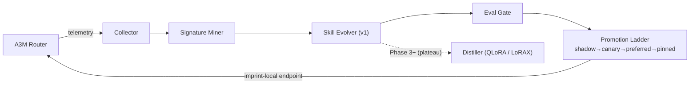

# Imprint

> *Every request leaves an imprint. Eventually, the imprints become instinct.*

**Self-learning task handler for [A3M Router](https://github.com/Das-rebel/a3m-router).**
Imprint watches router traffic, detects repeatable task patterns, and progressively
optimizes them — v1 by evolving context/skill-prompts, v2 by distilling weights into
self-managed local adapters.

```text
Your AI bill should decay over time.
```

## Architecture



## Model-agnostic

Imprint speaks **every major LLM API shape** — OpenAI ChatCompletion, Anthropic Messages,
Gemini-style contents, and raw completions — auto-detected on both ingest and serving.
It normalizes anything into its internal pair schema (with PII redaction) and responds
in the caller's native format. Works with A3M, LiteLLM, OpenRouter exports, or any gateway.

## CLI

```bash
python -m imprint collect /path/to/requests.jsonl   # ingest (any format)
python -m imprint mine                              # cluster + rank by economics
python -m imprint status                            # signatures + skill ladder
python -m imprint serve 8477                        # imprint-local endpoint
```

## Quickstart (dev)

```bash
git clone https://github.com/Das-rebel/imprint && cd imprint
pip install -e ".[dev]"
make test

# Phase 0 — point at your A3M request log (JSONL):
make collect LOG=/path/to/a3m-requests.jsonl
make mine   # prints signatures ranked by $ savings potential
```

## The Bill Decay Curve (goal)

```text
monthly AI cost
 │▇▇▇
 │▇▇▇▇▁▁
 │▇▇▇▇▇▇▇▁▁▁          ← as Imprint promotes skills:
 │▇▇▇▇▇▇▇▇▇▇▇▁▁▁        recurring tasks trend to ~$0 marginal
 └──────────────────▶ time
   wk1  wk2  wk4  wk8
```

Every promoted skill must beat the routed baseline on **both** cost and quality
(enforced in code — see `imprint/ladder.py`).

## Status: Phase 0

🚧 Validating the core hypothesis on real A3M traffic.
Roadmap + council-reviewed decisions: [PLAN.md](PLAN.md) · [ADRs](docs/adr/)

**Help wanted:** run the collector on your traffic and [share a Phase 0 report](.github/ISSUE_TEMPLATE/phase0-report.md).

## License

MIT © Subhajit Das
